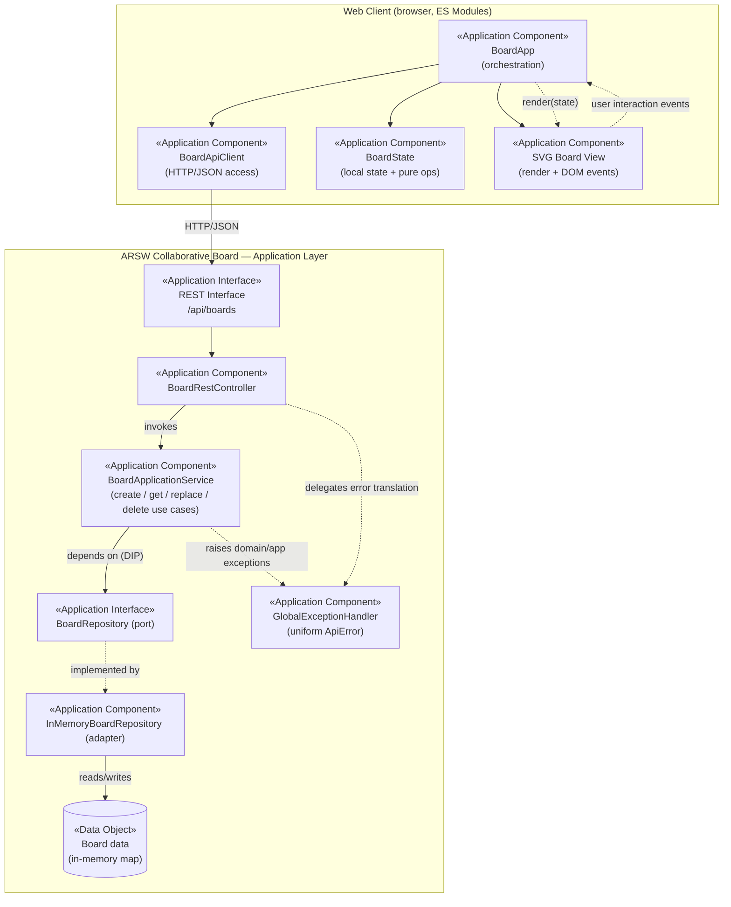

# ArchiMate Application View — Lab 05

Modeled using ArchiMate 3.2 Application Layer concepts (Application Component, Application Interface, Data Object). Rendered as a Mermaid diagram — no Archi/Draw.io installation was available in this environment — with the exact notation mapping documented below so it can be redrawn in Archi/Draw.io if required.

Evolved from the Lab 04 view: the client is no longer an opaque external box. `Web Client` is now decomposed into the three components required by the lab (`BoardApiClient`, `BoardState`, `SVG Board View`) plus their orchestrator (`BoardApp`), so the diagram shows the real dependency shape instead of a placeholder.

## Notation mapping

| Diagram element | ArchiMate concept |
|---|---|
| `BoardApp` | Application Component (orchestrates the other three client components — no HTTP, no SVG code of its own) |
| `BoardApiClient` | Application Component (the only component allowed to call `fetch`; translates non-2xx responses into a client-side error contract) |
| `BoardState` | Application Component (holds current board, selection, interaction mode, remote status; exposes pure list operations) |
| `SVG Board View` | Application Component (renders `BoardState` as SVG/DOM, turns mouse events into semantic callbacks — no persistence or HTTP knowledge) |
| `REST Interface` | Application Interface |
| `BoardRestController` | Application Component (exposes the interface, no business logic — RA-01) |
| `BoardApplicationService` | Application Component (realizes the Application Service / use cases) |
| `BoardRepository (port)` | Application Interface (output port, owned by the application boundary — RA-02) |
| `InMemoryBoardRepository (adapter)` | Application Component (realizes the port — RA-03) |
| `Board data (in-memory map)` | Data Object |
| `GlobalExceptionHandler` | Application Component (cross-cutting, centralizes the error contract — RA-05) |

This view matches the package/module structure actually implemented:

- Backend: `infrastructure.web.rest` → `application.service` → `application.port.out` → `infrastructure.persistence`.
- Client: `js/app.js` → (`js/api/board-api-client.js`, `js/state/board-state.js`, `js/ui/board-view.js`). `board-api-client.js` and `board-view.js` never import each other; both are only known to `app.js` (see `docs/ADR-002-client-boundaries.md`).
