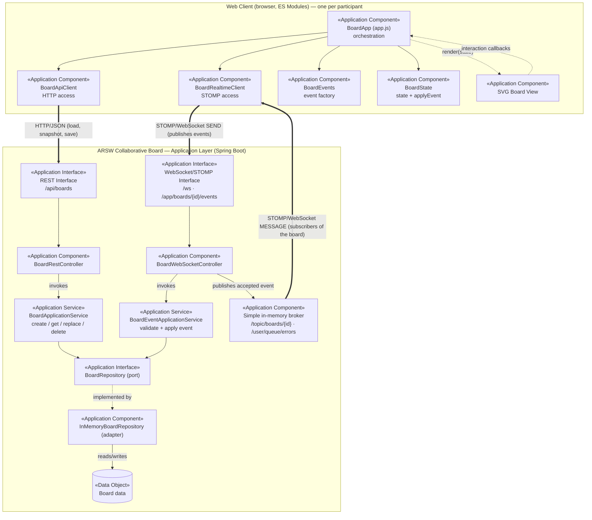

# ArchiMate Application View — Lab 06

Modeled using ArchiMate 3.2 Application Layer concepts (Application Component, Application Interface, Application Service, Data Object). Rendered as Mermaid — with the notation mapping below so it can be redrawn in Archi/Draw.io if required.

Evolved from the Lab 05 view, not redrawn: the same Web Client, REST interface, application service and repository remain; Lab 06 adds the **WebSocket/STOMP interface**, the **BoardEventApplicationService**, the **BoardRealtimeClient** in the browser, and the in-memory **message broker**. The two interaction styles are labeled explicitly: **HTTP/JSON** and **STOMP/WebSocket**.

## Who publishes, who subscribes

| Destination | Publisher | Subscribers |
|---|---|---|
| `/app/boards/{boardId}/events` | `BoardRealtimeClient` of the participant who made the change | `BoardWebSocketController` (application handler, not a broker topic) |
| `/topic/boards/{boardId}` | `BoardWebSocketController`, only after `BoardEventApplicationService` accepted the event | `BoardRealtimeClient` of **every** participant connected to that `boardId` (including the sender) |
| `/user/queue/errors` | `BoardWebSocketController` exception handlers | Only the session that sent the rejected event |

A participant connected to another `boardId` subscribes to a different topic and never receives these messages (session isolation, verified by `BoardRealtimeIntegrationTest`).

## Notation mapping

| Diagram element | ArchiMate concept | Code |
|---|---|---|
| `BoardApp` | Application Component | `static/js/app.js` |
| `BoardApiClient` | Application Component | `static/js/api/board-api-client.js` (only `fetch` caller) |
| `BoardRealtimeClient` | Application Component | `static/js/realtime/board-realtime-client.js` (only STOMP user) |
| `BoardEvents` | Application Component | `static/js/events/board-event.js` |
| `BoardState` | Application Component | `static/js/state/board-state.js` |
| `SVG Board View` | Application Component | `static/js/ui/board-view.js` |
| REST Interface | Application Interface | `/api/boards` |
| WebSocket/STOMP Interface | Application Interface | `/ws`, `/app/boards/{id}/events` (`WebSocketConfig`) |
| `BoardRestController`, `BoardWebSocketController` | Application Component | `infrastructure/web/rest`, `infrastructure/web/ws` |
| `BoardApplicationService`, `BoardEventApplicationService` | Application Service (realized by a component of the same name) | `application/service` |
| Simple in-memory broker | Application Component (Spring `SimpleBrokerMessageHandler`) | `WebSocketConfig.enableSimpleBroker` |
| `BoardRepository` | Application Interface (output port) | `application/port/out` |
| `InMemoryBoardRepository` | Application Component (adapter) | `infrastructure/persistence` |
| Board data | Data Object | `Map<String, Board>` |

`GlobalExceptionHandler` (REST error contract) is unchanged from Lab 05 and omitted here for readability; its STOMP counterpart is the `@MessageExceptionHandler` methods of `BoardWebSocketController`.
