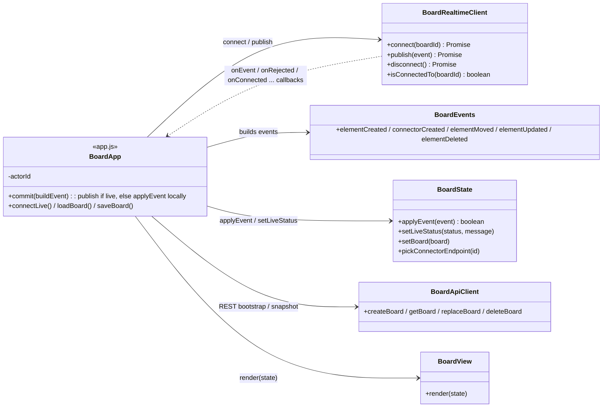

# Class / Module Diagram — Lab 06

Only the classes and modules that explain the real-time path and its relation to the existing model. Unchanged Lab 05 classes (`GlobalExceptionHandler`, `ApiError`, request DTOs) are omitted; see git history for the Lab 05 version of this file.

## Backend

```mermaid
classDiagram
    direction LR

    class WebSocketConfig {
        <<configuration>>
        +configureMessageBroker(registry) : /topic /queue, app /app, user /user
        +registerStompEndpoints(registry) : /ws
    }

    class BoardWebSocketController {
        -BoardEventApplicationService service
        -SimpMessagingTemplate messagingTemplate
        +handle(boardId, BoardEvent) : @MessageMapping /boards/{boardId}/events
        +boardNotFound(BoardNotFoundException) BoardEventError
        +invalidEvent(IllegalArgumentException) BoardEventError
        +unexpected(Exception) BoardEventError
    }

    class BoardEventError {
        <<record>>
        +Instant timestamp
        +String code
        +String message
    }

    class BoardRestController {
        -BoardApplicationService service
        +create / get / replace / delete
    }

    class BoardEventApplicationService {
        -BoardRepository repository
        +apply(BoardEvent) BoardEvent
    }

    class BoardApplicationService {
        -BoardRepository repository
        +createBoard / getBoard / replaceBoard / deleteBoard
    }

    class BoardEvent {
        <<record>>
        +String eventId
        +String boardId
        +BoardEventType type
        +String actorId
        +Instant occurredAt
        +BoardEventPayload payload
    }

    class BoardEventType {
        <<enumeration>>
        ELEMENT_CREATED
        ELEMENT_MOVED
        ELEMENT_UPDATED
        ELEMENT_DELETED
        CONNECTOR_CREATED
    }

    class BoardEventPayload {
        <<record>>
        +BoardElement element
        +String elementId
        +Double x
        +Double y
    }

    class InvalidBoardEventException
    class BoardNotFoundException

    class BoardRepository {
        <<interface>>
        +save(Board) Board
        +findById(String) Optional~Board~
        +existsById(String) boolean
        +deleteById(String) void
    }

    class InMemoryBoardRepository

    class Board {
        <<record>>
        +String id
        +String name
        +List~BoardElement~ elements
        +findElement(id) Optional~BoardElement~
        +withElementAdded(BoardElement) Board
        +withElementMoved(id, x, y) Board
        +withElementReplaced(BoardElement) Board
        +withElementRemoved(id) Board
    }

    class BoardElement {
        <<record>>
        +String id
        +ElementType type
        +double x, y, width, height
        +String text
        +String sourceId, targetId
        +movedTo(x, y) BoardElement
    }

    class ElementType {
        <<enumeration>>
        RECTANGLE
        TEXT
        CONNECTOR
    }

    WebSocketConfig ..> BoardWebSocketController : routes /app to
    BoardWebSocketController --> BoardEventApplicationService : apply(event)
    BoardWebSocketController ..> BoardEventError : sends to /user/queue/errors
    BoardWebSocketController ..> BoardEvent : receives / broadcasts
    BoardRestController --> BoardApplicationService : uses
    BoardEventApplicationService --> BoardRepository : depends on (DIP)
    BoardApplicationService --> BoardRepository : depends on (DIP)
    InMemoryBoardRepository ..|> BoardRepository : implements
    BoardEventApplicationService ..> Board : applies transition
    BoardEventApplicationService ..> InvalidBoardEventException : throws
    BoardEventApplicationService ..> BoardNotFoundException : throws
    BoardEvent --> BoardEventType
    BoardEvent *-- BoardEventPayload
    BoardEventPayload --> BoardElement : references
    Board *-- BoardElement : contains
    BoardElement --> ElementType
```

## Client modules



## Key dependency directions (verifiable in code)

- `BoardWebSocketController` → `BoardEventApplicationService` → `BoardRepository` (port). The STOMP adapter never touches the repository or the domain transitions directly; broadcast happens only after `apply` returns.
- `application.event` (`BoardEvent`, `BoardEventType`, `BoardEventPayload`) depends on `domain.model` (`BoardElement`), never the other way around: the domain has no knowledge of events, STOMP or JSON.
- Spring messaging types (`SimpMessagingTemplate`, `@MessageMapping`, `@SendToUser`) appear only in `infrastructure.web.ws`.
- Client: `grep -rn "Stomp\|/topic\|/app/" src/main/resources/static/js` only matches `js/realtime/board-realtime-client.js`; `fetch(` only matches `js/api/board-api-client.js`. `BoardRealtimeClient` imports no other module; `BoardState` has no DOM or STOMP references. `app.js` is the only module that wires them together.
